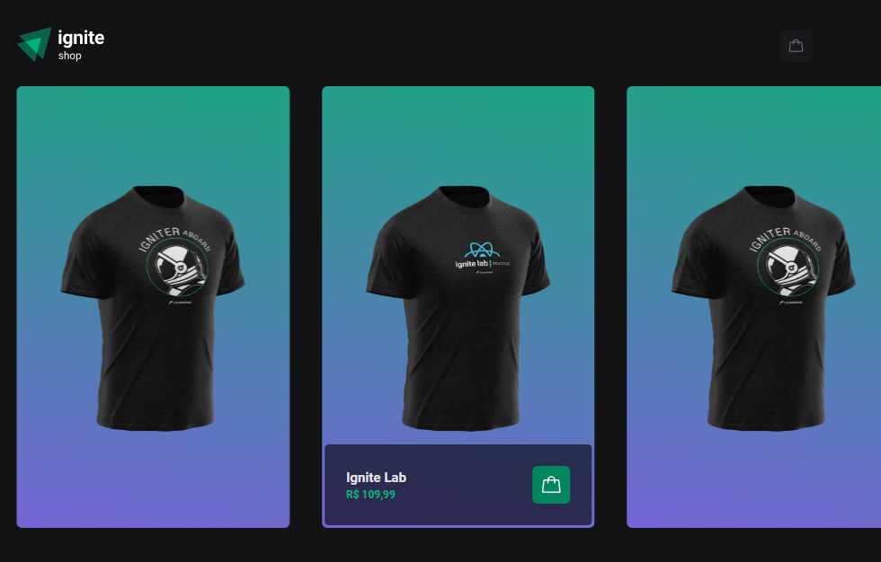
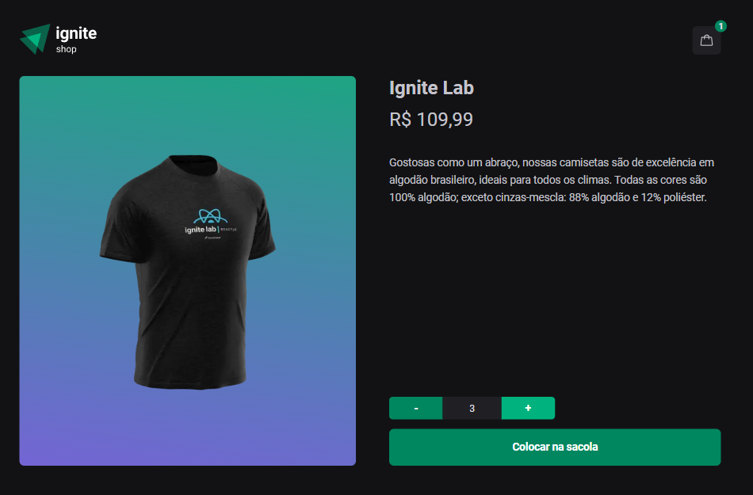
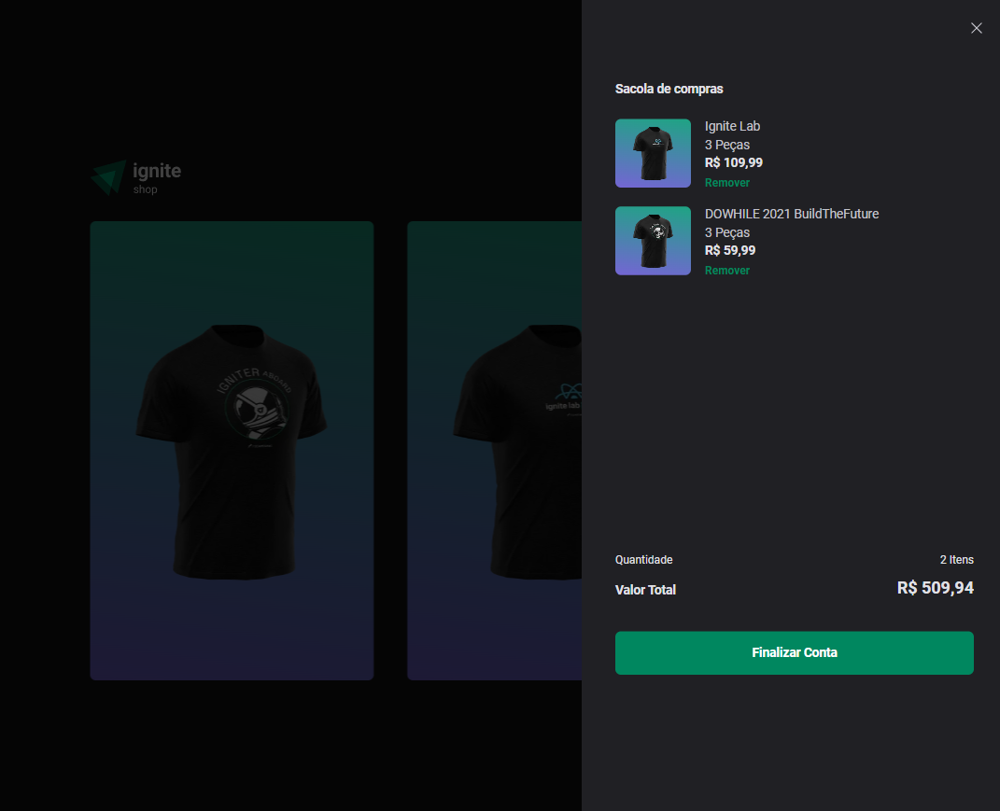
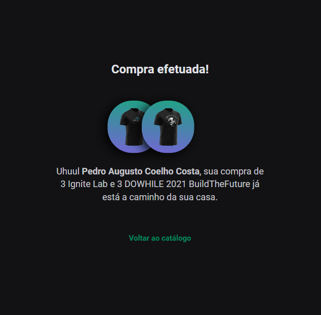

<div align='center'>
  
  
  
  
</div>

# Sobre o projeto 💬

O **Ignite_Shop** é uma aplicação web desenvolvida na Rocketseat, sobre uma loja online de venda de camisetas

## Funcionalidades 🧠

###  📕 A aplicação contém as seguintes funcionalidades:

- [x] Visualizar todas as camisetas disponíveis
- [x] Selecionar uma camiseta e a quantidade para efetuar a compra
- [x] Visualizar suas compras 
- [x] Finalizar a compra
- [x] Efetuar o pagamento utilizando Stripe 

## Pré-requisitos
#### Antes de começar, é bom ter instalado em sua maquina as seguintes ferramentas:
- [x] [GIT](https://git-scm.com/)
- [x] [VSCode](https://code.visualstudio.com/)
- [x] [NodeJs](https://nodejs.org/en/)

### Rodando o Projeto 📖

```bash
# Clone para este repositório
$ git clone https://github.com/Pedro-AugusCoelho/Ignite_Shop.git

# Acesse a pasta do projeto no terminal/cmd
$ cd Ignite_Shop

# Instale as dependências
$ npm install

# Preencha o .env.local para aplicação rodar
$ NEXT_URL= // URL DA APLICAÇÃO
$ STRIPE_PUBLIC_KEY= // CHAVE PUBLICA DO STRIPE
$ STRIPE_SECRET_KEY= // CHAVE PRIVADA DO STRIPE

# Execute a aplicação em modo de desenvolvimento
$ npm run dev

# O projeto iniciará na porta:3000 - acesse <http://127.0.0.1:3000>
```

## Tecnologias 🛠

Desenvolvido utilizando as seguintes tecnologias:

- [REACT.JS](https://reactjs.org/)
- [NEXT.JS](https://nextjs.org/)
- [TYPESCRIPT](https://www.typescriptlang.org/)
- [STITCHES](https://stitches.dev/)
- [KEEN-SLIDER](https://keen-slider.io/)
- [TOASTTIFY](https://fkhadra.github.io/react-toastify/introduction)
- [STRIPE](https://stripe.com/br)
- [PHOSPHOR-REACT](https://phosphoricons.com/)
- [RADIX-UI](https://www.radix-ui.com/themes/docs/overview/getting-started)
- [AXIOS](https://www.npmjs.com/package/axios)
- [ESLINT](https://eslint.org/)

## Desenvolvido ##

- [Rocketseat](https://www.rocketseat.com.br/index)

